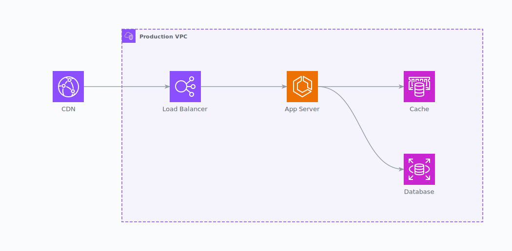
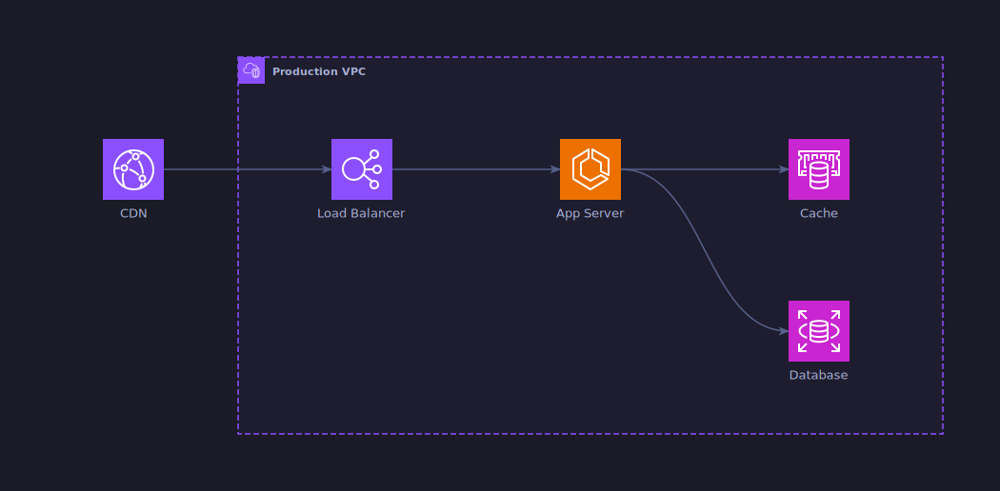
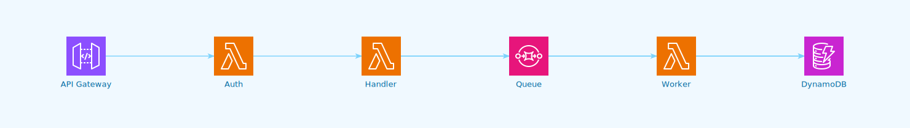
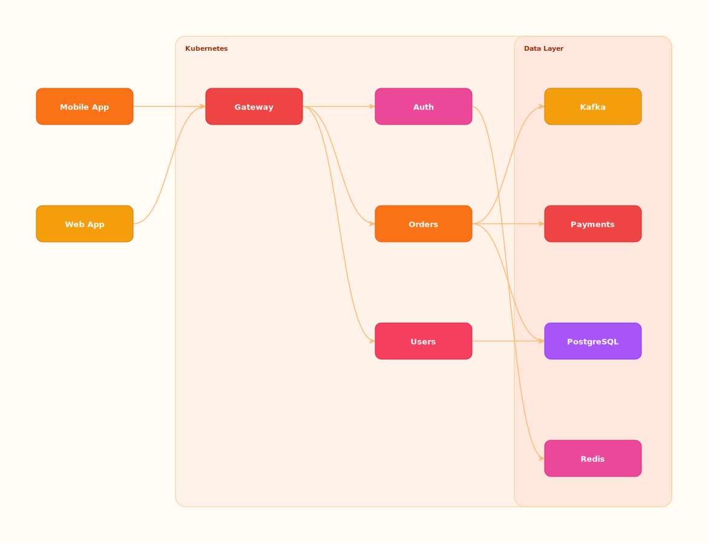

<h1 align="center">
  Archflow
</h1>

<p align="center">
  <strong>Architecture diagrams that live in your codebase, not in your browser.</strong>
</p>

<p align="center">
  <a href="https://github.com/soulee-dev/archflow/actions"></a>
  <a href="https://github.com/soulee-dev/archflow/blob/main/LICENSE"></a>
  <a href="https://soulee-dev.github.io/archflow/"></a>
</p>

<p align="center">
  <a href="https://soulee-dev.github.io/archflow/">Playground</a> &middot;
  <a href="#quick-start">Quick Start</a> &middot;
  <a href="#examples">Examples</a> &middot;
  <a href="#providers">Providers</a> &middot;
  <a href="#themes">Themes</a>
</p>

---


<p align="center">
  
</p>

## Why Archflow?

- **Zero external dependencies** - No Graphviz, no system packages. Just `pip install` and go.
- **Rust-powered, millisecond rendering** - Own layout engine. No subprocess calls, no waiting.
- **Deterministic** - Same code always produces the exact same SVG. No layout jitter between runs.
- **SVG-native** - Vector output by default. Crisp at any zoom, embeddable anywhere.
- **Language-agnostic** - JSON IR means any language can generate diagrams. Python, TypeScript, Go — same engine.
- **Runs in the browser** - Full rendering via WebAssembly. Try diagrams without installing anything.
- **Pluggable icon registry** - 300+ AWS, 19+ GCP, 39 K8s icons. Add your own provider with a manifest + SVGs.
- **6 built-in themes** - Beautiful by default, fully customizable.

### vs. diagrams

[diagrams](https://github.com/mingrammer/diagrams) is the closest alternative. Key differences:

| | diagrams | Archflow |
|---|---|---|
| Rendering | Graphviz (external C binary) | Rust (self-contained, no system deps) |
| Output | PNG (raster) | SVG (vector) |
| Speed | Subprocess per render | Milliseconds (native/WASM) |
| Runtime | Python only | Python, CLI, WASM, any language via JSON IR |
| Browser | Not possible | Full WASM playground |
| Icons | Bundled in package | External registry (pluggable, cacheable) |
| Layout | Graphviz `dot` | Own topological sort (deterministic) |

## Quick Start

### Install from source

```bash
# Python library (with native Rust FFI)
cd packages/python && pip install maturin && maturin develop

# CLI
cargo build --release -p archflow-cli
```

## Examples

### AWS with Provider Icons

300+ official AWS icons. Provider-aware VPC clusters with dashed borders.

```
title: AWS Web Service
direction: LR
icon_size: 64
spacing: 80
use aws

aws:cloudfront CDN >> aws:elb Load Balancer >> aws:ecs App Server >> aws:rds Database
aws:ecs App Server >> aws:elasticache Cache

cluster:aws:vpc Production VPC {
  aws:elb Load Balancer
  aws:ecs App Server
  aws:rds Database
  aws:elasticache Cache
}
```

<p align="center">
  
</p>

### Dark Theme

Same diagram, one line change: `theme: dark`.

<p align="center">
  
</p>

### Serverless (Ocean Theme)

```
title: Serverless API
direction: LR
theme: ocean
icon_size: 64
use aws

aws:api-gateway API Gateway >> aws:lambda Auth >> aws:lambda Handler >> aws:dynamodb DynamoDB
aws:lambda Handler >> aws:sqs Queue >> aws:lambda Worker
aws:lambda Worker >> aws:dynamodb DynamoDB
```

<p align="center">
  
</p>

### Microservices (Sunset Theme)

No provider icons needed — plain nodes with clusters work too.

```python
from archflow import Diagram, Node, Cluster

with Diagram("Microservices", direction="LR", theme="sunset") as d:
    mobile = Node("mobile", "Mobile App")
    web = Node("web", "Web App")
    with Cluster("k8s", "Kubernetes"):
        gw = Node("gw", "Gateway")
        with Cluster("svc", "Services"):
            auth = Node("auth", "Auth")
            user = Node("user", "Users")
            order = Node("order", "Orders")
            payment = Node("pay", "Payments")
    with Cluster("data", "Data Layer"):
        pg = Node("pg", "PostgreSQL")
        redis = Node("redis", "Redis")
        kafka = Node("kafka", "Kafka")
    mobile >> gw
    web >> gw
    gw >> auth
    gw >> user >> pg
    gw >> order >> pg
    order >> payment
    order >> kafka
    auth >> redis
    d.save_svg("microservices.svg")
```

<p align="center">
  
</p>

### DSL (Playground)

No Python needed. Write directly in the DSL:

```
title: AWS Web Service
direction: LR
use aws

aws:ELB Load Balancer >> aws:EC2 Web Server >> aws:RDS Database
aws:EC2 Web Server >> aws:S3 Static Assets

cluster:aws:vpc Production VPC {
  aws:EC2 Web Server
  aws:RDS Database
}
```

Try it live in the [Playground](https://soulee-dev.github.io/archflow/).

## Providers

Icons are loaded from the [archflow-icons](https://github.com/soulee-dev/archflow-icons) registry.

### AWS (307 nodes, 11 clusters)

```python
from archflow.providers.aws import EC2, Lambda, RDS, S3, Dynamodb, ELB, Cloudfront, SQS, SNS
```

Cluster types: `Region`, `VPC`, `Subnet`

### GCP (19 nodes)

```python
from archflow.providers.gcp import ComputeEngine, CloudSQL, BigQuery, GKE, CloudRun, VertexAI
```

Cluster types: `Region`, `VPC`, `Subnet`, `Project`, `Zone`

### Kubernetes (39 nodes)

```python
from archflow.providers.k8s import Pod, Deployment, Service, Ingress, StatefulSet, ConfigMap, Secret
```

Cluster types: `Cluster`, `Namespace`

## Themes

6 built-in themes, fully customizable:

| Theme | Style |
|-------|-------|
| `default` | Professional, colorful palette |
| `dark` | Dark background, Tokyonight-inspired |
| `ocean` | Blue/cyan tones |
| `sunset` | Warm orange/red tones |
| `forest` | Green tones |
| `minimal` | Clean outlines, no shadows |

```python
# Custom theme overrides
with Diagram("Custom", custom_theme={
    "background": "#0D1117",
    "node_palette": [{"fill": "#58A6FF", "stroke": "#388BFD"}],
    "node_shadow": False,
}) as d:
    ...
```

## Architecture

```
                    Python DSL / JSON IR
                           |
                     Validation
                           |
                   Layout (Kahn's topological sort)
                           |
                   Theme Resolution
                           |
                   Scene Graph
                           |
                       SVG Output
```

| Path | Purpose |
|------|---------|
| `crates/archflow-core` | DSL parser, layout, themes, scene graph, SVG renderer |
| `crates/archflow-cli` | `archflow render` command |
| `crates/archflow-lsp` | Language Server Protocol for editor support |
| `bindings/python-ffi` | Python native bindings via PyO3 |
| `bindings/wasm` | WebAssembly build for the browser playground |
| `packages/python` | Python SDK (Diagram, Node, Cluster, providers) |
| `apps/vscode` | VS Code extension |

## Development

```bash
# Run tests
cargo test

# Lint
cargo clippy && cargo fmt --check
ruff check packages/python/ && ruff format --check packages/python/

# Build WASM for playground
wasm-pack build bindings/wasm --target web --out-dir ../../docs/pkg
```

## License

[MIT](LICENSE)
